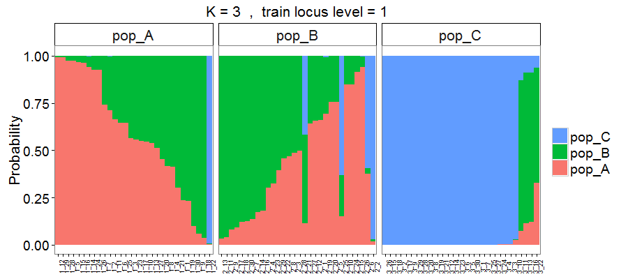

In this page, we show how to make box plots and stacked bar plots for assignment accuracy and membership probability, respectivly.

***
```{r, echo=FALSE}
library(assignPOP)
```
## Assignment accuracy box plot

```{r read accuMC file, include = FALSE}
accuMC <- read.table("data/AAMC_fst_svm_Genetics.txt", header=T)
```

To visualize the results of assignment accuracy, use the following function to create a boxplot. 

```{r run accuracy.plot, fig.align='center', fig.width=10, fig.asp=0.6, fig.cap="Figure 1. Assignment accuracies estimated via Monte-Carlo cross-validation, with three levels of training individuals (50%, 70% and 90% of individuals from each population, on x-axis) by four levels of training loci (top 10%, 25% and 50% highest Fst loci and all loci in color-coded boxes) by 30 resampling events."}
accuracy.plot(accuMC, pop = "all")
```

Note that the argument `pop` is used to specify which population to be included in the plot. You can specify multiple populations in the argument (e.g., `pop=c("pop_A","pop_B")`) to make a faceted plot (population names are those you provided in the function `read.genpop()`). If the population is not specified, assignment accuracy of overall population (arg. `pop="all"`) will be plotted as the default.

The function `accuracy.plot()` is built based on the [ggplot2](https://cran.r-project.org/web/packages/ggplot2/ggplot2.pdf) library, so you can import the library `library(ggplot2)` and modify the plot using [ggplot2 functions/arguments](http://docs.ggplot2.org/current/). For example, set the *y*-axis (assignment accuracy) limits (`ylim()`), draw a horizontal line (`annotate()`), or add a plot title (`ggtitle()`).

```{r modify AA plot, fig.align='center', fig.width=10, fig.asp=0.6, collapse=TRUE, warning=FALSE, fig.cap="Figure 2. Assignment accuracies estimated via Monte-Carlo cross-validation, with genetic data (693 SNP loci) for three hypothetical populations of 30 individuals. Red horizontal lines indicate 0.33 null assignment rate."}
library(ggplot2)
accuracy.plot(accuMC, pop=c("all", "pop_A", "pop_B", "pop_C")) +
  ylim(0, 1) + #Set y limit between 0 and 1
  annotate("segment",x=0.4,xend=3.6,y=0.33,yend=0.33,colour="red",size=1) + #Add a red horizontal line at y = 0.33 (null assignment rate for 3 populations)
  ggtitle("Monte-Carlo cross-validation using genetic loci")+ #Add a plot title
  theme(plot.title = element_text(size=20, face="bold")) #Edit plot title text size
```

The above results were estimated from the genetic-only dataset. Assignment accuracies between populations A and B are relatively low, indicating that the genetic data could not distinguish between them well. However, assignment accuracies of population C are much higher, suggesting that the genetic loci can be used to differentiate population C from the other two populations. Next, we can perform the assignment test on the genetic-morphometric dataset (using object `comin` returned from `compile.data()`) to see if using integrated data improves assignment success. (We skip the codes and show the final result below)

```{r create faceted plots for integrated data, echo=FALSE, fig.align='center', fig.width=10, fig.asp=0.6, fig.cap="Figure 3. Assignment accuracies estimated via Monte-Carlo cross-validation, using genetic and morphometric data. Each box is the results of using a proportion of training loci plus 4 morphometric variables"}
accuMC_con <- read.table("data/AAMC_fst_svm_GeneMorph.txt", header=T)
accuracy.plot(accuMC_con, pop=c("all", "pop_A", "pop_B", "pop_C")) +
  ylim(0, 1) + #Set y limit between 0 and 1
  annotate("segment",x=0.4,xend=3.6,y=0.33,yend=0.33,colour="red",size=1) + #Add a red horizontal line at y = 0.33 (null assignment rate for 3 populations)
  ggtitle("Monte-Carlo cross-validation using\ngenetic loci and morphometric data")+ #Add a plot title
  theme(plot.title = element_text(size=20, face="bold")) #Edit plot title text size
```

When using the genetic-morphometric dataset, the assignment accuracies of populations A and B increased and that of population C remained high, resulting in increasing overall assignment accuracy. These results demonstrate the potential of using multiple data types to improve assignment success. Additionally, we can use the same analytical methods (i.e., Monte-Carlo cross-validation with the same proportions of training individuals, iterations, and classifier) to evaluate morphormetric data alone. The results are as follows.

```{r , echo=FALSE, fig.align='center', fig.width=10, fig.asp=0.6, fig.cap="Figure 4. Assignment accuracies estimated via Monte-Carlo cross-validation, using 4 morphormetric measurements."}
accuMC_morph <- read.table("data/AAMC_svm_pcat_Morphs.txt", header=T)
accuracy.plot(accuMC_morph, pop=c("all", "pop_A", "pop_B", "pop_C")) +
  ylim(0, 1) + #Set y limit between 0 and 1
  annotate("segment",x=0.4,xend=3.6,y=0.33,yend=0.33,colour="red",size=1) + #Add a red horizontal line at y = 0.33 (null assignment rate for 3 populations)
  ggtitle("Monte-Carlo cross-validation using morphometric data")+ #Add a plot title
  theme(plot.title = element_text(size=20, face="bold")) #Edit plot title text size
```

The above results indicate that morphormetric data helps distinguish population A from the other two. Therefore, it is exepected that using integrated data would best discriminate among the three populations (Figure 3) despite that fact that using genetics or morphormetrics alone was unable to distinguish population B from the other two (see population B in Figure 2 and 4).      

## Membership probability stacked bar plot

In addition to estimating assignment accuracy, we can also use probabilities to understand how individuals are assigned to populations. To visualize membership probility, we use the results from *K*-fold cross-validation and create a stacked bar plot (also known as [**STRUCTURE plot**](http://pritchardlab.stanford.edu/structure.html)) that is commonly used in molecular biology papers. To create the plot, use the following function and specify the folder containing your *K*-fold cross-validation results.

```{r create membership plot, eval=FALSE }
membership.plot(dir = "Result-folder2/")
```

After entering the code, it will prompt a few questions and allow you to choose which dataset and plot style to be used. The interactive conversation is shown as follows.

```{r print membership.plot Q1, echo=FALSE}
cat("K = 3  4  5  are found.\
Please enter one of the K numbers: (You will enter your answer here)")
```

Next, it will ask you to enter which proportion of training loci you would like to make the plot for.

```{r print membership.plot Q2, echo=FALSE}
cat("4 levels of training loci are found.\
Levels[train.loci]: 0.1  0.25  0.5  1\
Please enter one of the levels: (You will enter your answer here)")
```

Lastly, if you didn't specify the output style (e.g., `style = 1`) in `membership.plot()`, then it will print the following text and ask you to choose an output style.

```{r print membership.plot Q3, echo=FALSE}
cat("Finally, select one of the output styles.\
[1] Random order (Individuals on x-axis are in random order)\
[2] Sorted by probability (Individuals are sorted by probabilities within each group)\
[3] Separated by fold (Individuals of different folds are in separate plots)\
[4] Separated and Sorted (Individuals are separated by fold and sorted by probability)\
Please enter 1, 2, 3, or 4: (You will enter your answer here)")
```

Below we use the results of 3-fold and all loci (train.loci = 1) to demonstrate membership probability plots, with four different output styles.





The above Figures 5 to 8 are the results from the genetic-only dataset. Here we also analyzed the genetic-morphometric data and created the following membership probability plot. 


Using the integrated dataset allowed many more correct assignments than using the genetic data alone (see Figure 5 or 6 vs. 9). 
